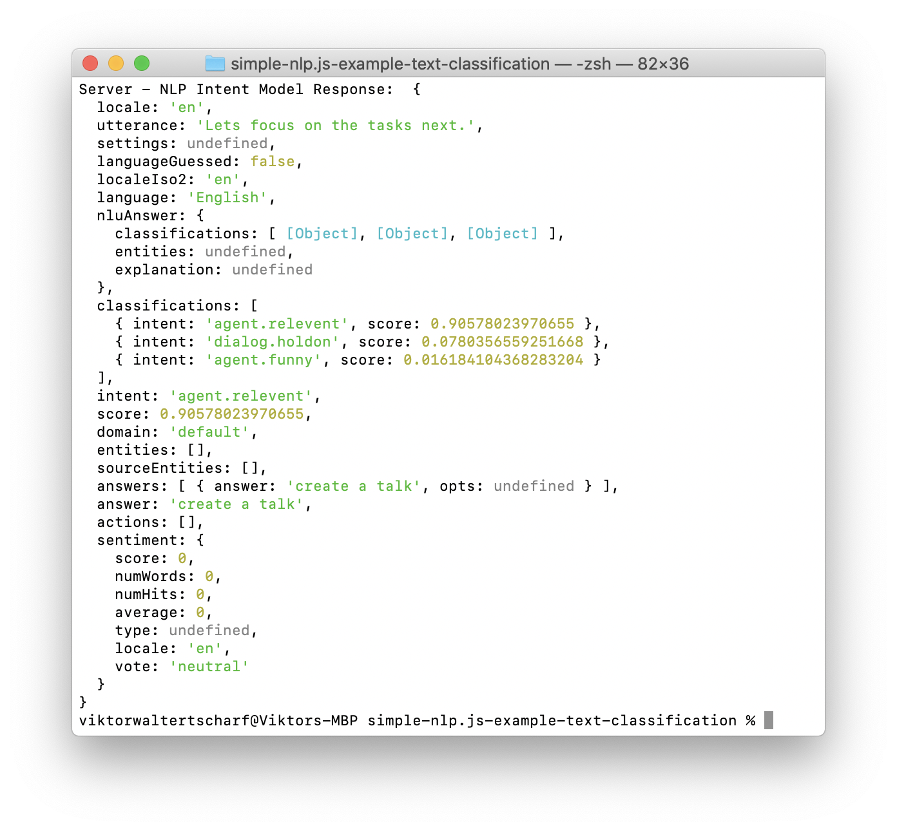

# Simple nlp.js Example Text Classification Model
Simple nlp.js Example Text Classification. This repo is an easy example how to identify which sentance of a text is relevant. Text relevants detection also own as intent cclassification.

## Getting Started

1. Install deps
run ```npm install```
2. Run the node js file
run ```npm start```
3. See the output in the console.
The Text sentance "Lets focus on the tasks next." was classefied as important. You can see that at the agend.relevant intent classification.
4. Change the text input in the code.

## Screenshots





